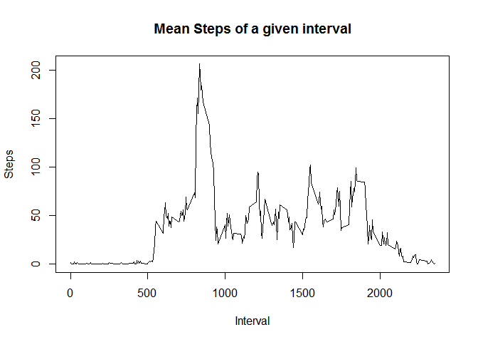

# Reproducible Research: Peer Assessment 1

## Loading and preprocessing the data

Load the data (i.e. read.csv())

```r
unzip("activity.zip")
activity<-read.csv("activity.csv")
```

Process/transform the data (if necessary) into a format suitable for your analysis


## What is mean total number of steps taken per day?

For this part of the assignment, you can ignore the missing values in the dataset.

1. Calculate the total number of steps taken per day  
Code:

```r
activityWithValues <- activity[!is.na(activity$steps),]
sumStepsByDate <-aggregate(steps ~ date, data=activityWithValues, sum)
```
output:

```r
sumStepsByDate
```

```
##          date steps
## 1  2012-10-02   126
## 2  2012-10-03 11352
## 3  2012-10-04 12116
## 4  2012-10-05 13294
## 5  2012-10-06 15420
## 6  2012-10-07 11015
## 7  2012-10-09 12811
## 8  2012-10-10  9900
## 9  2012-10-11 10304
## 10 2012-10-12 17382
## 11 2012-10-13 12426
## 12 2012-10-14 15098
## 13 2012-10-15 10139
## 14 2012-10-16 15084
## 15 2012-10-17 13452
## 16 2012-10-18 10056
## 17 2012-10-19 11829
## 18 2012-10-20 10395
## 19 2012-10-21  8821
## 20 2012-10-22 13460
## 21 2012-10-23  8918
## 22 2012-10-24  8355
## 23 2012-10-25  2492
## 24 2012-10-26  6778
## 25 2012-10-27 10119
## 26 2012-10-28 11458
## 27 2012-10-29  5018
## 28 2012-10-30  9819
## 29 2012-10-31 15414
## 30 2012-11-02 10600
## 31 2012-11-03 10571
## 32 2012-11-05 10439
## 33 2012-11-06  8334
## 34 2012-11-07 12883
## 35 2012-11-08  3219
## 36 2012-11-11 12608
## 37 2012-11-12 10765
## 38 2012-11-13  7336
## 39 2012-11-15    41
## 40 2012-11-16  5441
## 41 2012-11-17 14339
## 42 2012-11-18 15110
## 43 2012-11-19  8841
## 44 2012-11-20  4472
## 45 2012-11-21 12787
## 46 2012-11-22 20427
## 47 2012-11-23 21194
## 48 2012-11-24 14478
## 49 2012-11-25 11834
## 50 2012-11-26 11162
## 51 2012-11-27 13646
## 52 2012-11-28 10183
## 53 2012-11-29  7047
```

2. If you do not understand the difference between a histogram and a barplot, research the difference between them. Make a histogram of the total number of steps taken each day  
Code and plot:

```r
library(ggplot2)
qplot(steps, data=sumStepsByDate)
```

```
## stat_bin: binwidth defaulted to range/30. Use 'binwidth = x' to adjust this.
```

 

3. Calculate and report the mean and median of the total number of steps taken per day  
Code:

```r
means<-mean(sumStepsByDate$steps)
medians<-median(sumStepsByDate$steps)
```

mean and median of the total number of steps taken per day are 1.0766189\times 10^{4} and 10765


## What is the average daily activity pattern?  
1. Make a time series plot (i.e. type = "l") of the 5-minute interval (x-axis) and the average number of steps taken, averaged across all days (y-axis)

Code and plot:

```r
meanStepsByinterval<-aggregate(steps ~ interval, data=activity, mean)
plot(y=meanStepsByinterval$steps, x=meanStepsByinterval$interval, type="l", ylab="Steps", xlab="Interval",  main="Mean Steps of a given interval")
```

 

2. Which 5-minute interval, on average across all the days in the dataset, contains the maximum number of steps?
Code:

```r
maxStep<-meanStepsByinterval[ (meanStepsByinterval$steps==max(meanStepsByinterval$steps)),]
```
At 835, the maximum average step is 206.1698113

## Imputing missing values


## Are there differences in activity patterns between weekdays and weekends?
